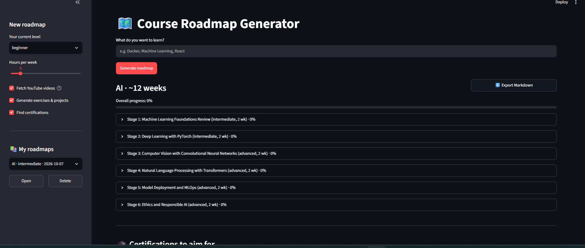
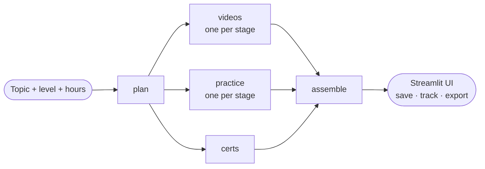

# 🗺️ Course Roadmap Generator

Type any topic and get a complete, staged learning roadmap. Every stage comes with **top YouTube videos**, **hands-on exercises**, a **project**, and the roadmap ends with **real certifications** to aim for. Progress is tracked and saved, and roadmaps can be exported to Markdown.

Built with **LangGraph**, **Groq (gpt-oss)**, the **YouTube Data API v3**, and **Streamlit**.

 

## Features

- **Structured roadmap planner**: 5–8 ordered stages from basics to job-ready, adapted to your level and weekly hours.
- **Smart video curation**: videos are scored, not just sorted by views (see [How videos are ranked](#how-videos-are-ranked)).
- **Exercises and projects**: 4–6 progressive exercises per stage plus a project with checkable deliverables and a stretch goal.
- **Real certifications only**: the LLM picks from a curated catalog (it can't invent one), and each link is checked live.
- **Parallel LangGraph pipeline**: videos, practice and certifications are generated concurrently; one failing task becomes a warning instead of breaking the run.
- **Save and resume**: roadmaps and progress are stored in a local SQLite database.
- **Progress tracking**: tick off videos, exercises and deliverables, with a percentage per stage and overall.
- **Markdown export**: download the roadmap with your checkboxes included.

## How it works



1. **`plan`** asks the LLM for a structured roadmap (stages, objectives, YouTube search queries).
2. LangGraph's `Send` API fans out one `videos` task and one `practice` task per stage, plus one `certs` task, all running in parallel.
3. **`assemble`** merges the results into one `Roadmap`, along with any warnings.

Print the graph yourself with `python pipeline.py --diagram`.

### How videos are ranked

For each stage the app searches YouTube, fetches fresh statistics, drops Shorts (under 4 minutes) and videos with under 1,000 views, then scores each video:

| Signal | Weight |
|---|---|
| Views (log scale) | 40% |
| Like ratio | 25% |
| Recency | 15% |
| Channel size | 10% |
| Duration fit | 10% |

At most 2 videos per channel are kept, so results stay diverse. Weights live at the top of `youtube_curator.py`.

### Reliable structured output

All LLM calls go through `llm.py`, which uses Groq's **strict structured outputs** (constrained decoding) so the model returns valid JSON that matches the schema. If Groq rejects a schema, it falls back to function calling automatically.

### Certifications

`certifications.json` is a hand-curated catalog (AWS, Azure, Google Cloud, Linux Foundation, CompTIA, Coursera, Databricks, Hugging Face and more). The LLM only chooses ids from it, invented ids are dropped, and each chosen link is checked live. If nothing fits a topic, the app shows Coursera and edX search links, labelled as search links.

## Tech stack

| Layer | Choice |
|---|---|
| Orchestration | LangGraph |
| LLM | Groq, `openai/gpt-oss-120b` (configurable) |
| Videos | YouTube Data API v3 |
| Storage and cache | SQLite |
| UI | Streamlit |
| Models and validation | Pydantic |

## Project structure

```
course-roadmap/
├── app.py               # Streamlit UI
├── pipeline.py          # LangGraph graph (plan → videos/practice/certs → assemble)
├── planner.py           # Roadmap planner
├── practice.py          # Exercises and project generator
├── youtube_curator.py   # YouTube search, scoring, caching
├── cert_finder.py       # Certification picker and link checker
├── certifications.json  # Curated certification catalog (edit freely)
├── llm.py               # Structured LLM calls (strict mode + fallback)
├── schemas.py           # Pydantic models
├── storage.py           # Saved roadmaps and progress (SQLite)
├── export.py            # Markdown export
├── requirements.txt
└── .env.example
```

## Getting started

### 1. Clone and install

```bash
git clone https://github.com/<vyshnavipusarla>/course-roadmap.git
cd course-roadmap
python -m venv venv
```

Activate the environment:

```powershell
# Windows (PowerShell)
venv\Scripts\activate
# If scripts are blocked: Set-ExecutionPolicy -Scope CurrentUser -ExecutionPolicy RemoteSigned
```

```bash
# macOS / Linux
source venv/bin/activate
```

Then install the dependencies:

```bash
pip install -r requirements.txt
```

### 2. Get your API keys

- **Groq**: create a key at [console.groq.com](https://console.groq.com).
- **YouTube Data API v3**: in [Google Cloud Console](https://console.cloud.google.com), create a project, enable **YouTube Data API v3** (APIs & Services → Library), then create an **API key** (APIs & Services → Credentials). Restricting the key to the YouTube Data API is recommended.

### 3. Configure

```bash
cp .env.example .env        # Windows: copy .env.example .env
```

Fill in `.env`:

| Variable | Required | Description |
|---|---|---|
| `GROQ_API_KEY` | yes | Groq API key |
| `YOUTUBE_API_KEY` | yes | YouTube Data API v3 key |
| `GROQ_MODEL` | no | Defaults to `openai/gpt-oss-120b` |
| `MAX_CONCURRENCY` | no | Parallel tasks in the graph (default 4) |

### 4. Run

```bash
streamlit run app.py
```

Or test the backend from the terminal:

```bash
python pipeline.py "Docker"
```

## YouTube API quota

The free quota is limited (10,000 units per day by default) and each search costs 100 units. A new topic uses roughly 1,200 units. Search results are cached in SQLite for 7 days, so repeated topics cost almost nothing, and the sidebar lets you turn video fetching off while testing.

## Known limitations

- Certification details and exam fees change. The catalog stores cost types, not prices, and the UI reminds users to confirm on the provider's site. Some sites block automated link checks, shown as a ⚠️ rather than ✅.
- Roadmap quality depends on the LLM; vague topics (for example just "AI") work better when narrowed.
- Data is stored locally (`roadmaps.db`, `cache.db`), with no user accounts.

## Roadmap

- [ ] PDF export
- [ ] Refresh videos for a saved roadmap
- [ ] User accounts and cloud storage
- [ ] Automated tests and CI

## Contributing

Issues and pull requests are welcome. To add a certification, append an entry to `certifications.json` with `id`, `name`, `provider`, `url`, `cost`, `level` and `tags`.

## License

Add a license of your choice (for example MIT) as a `LICENSE` file.
